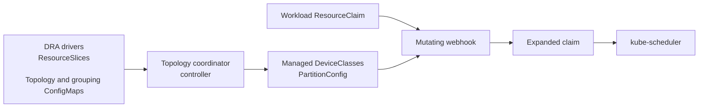

# Node Partition Topology Coordinator

The Node Partition Topology Coordinator is a Kubernetes controller and mutating webhook for [Dynamic Resource Allocation (DRA)](https://kubernetes.io/docs/concepts/scheduling-eviction/dynamic-resource-allocation/). It lets workloads request a logical partition of a node without knowing which DRA drivers, device attributes, or topology constraints provide that partition.

The coordinator does not replace the scheduler or the DRA drivers. It watches the drivers' `ResourceSlice` objects, publishes topology-aware `DeviceClass` objects, and expands partition claims into the individual device requests required by the scheduler.

## How it works



The leader-elected controller:

- reads `ResourceSlice` topology from all DRA drivers;
- computes fixed partitions and administrator-defined device groupings;
- publishes coordinator-managed `DeviceClass` objects with CEL selectors and opaque `PartitionConfig` data; and
- removes stale coordinator-managed `DeviceClass` objects during reconciliation.

The webhook runs on every replica and:

- expands a partition `ResourceClaim` into its driver-specific sub-resource requests;
- adds per-driver topology selectors and any configured `matchAttribute` constraints;
- injects VFIO configuration for supported passthrough devices when needed; and
- rewrites Pod and KubeVirt VMI references to the expanded request names.

Ordinary DRA claims that do not reference a coordinator `PartitionConfig` pass through unchanged. No scheduler plugin is required.

## Partition outputs

The controller publishes `DeviceClass` objects for the topology it discovers. The fixed partition classes are:

| Partition type | Scope |
| --- | --- |
| `pcieroot` | Devices attached to one PCIe root complex, with proportional CPU or memory capacity where available |
| `numa` | Devices grouped within one NUMA topology group |
| `full` | The complete effective device set for a node |

Aggregate classes are also published with names such as `pcieroot`, `numa`, and `full`. When the hardware has a recognizable PCIe-root fraction, the controller may publish tier aliases such as `eighth`, `quarter`, `half`, or `sixth`. These aliases are hardware-dependent; inspect the generated classes before selecting one:

```sh
kubectl get deviceclasses \
  -l nodepartition.dra.k8s.io/managed=true
```

Profile-specific and grouping classes may also be present. DeviceClass names are derived from the participating DRA drivers and topology shape, so they should be discovered from the cluster rather than hard-coded across hardware profiles.

### Default `auto` output

The Helm chart and controller default to `auto`. With devices available, this mode produces the following baseline output where the corresponding topology exists:

| Generated class | When it appears | Notes |
| --- | --- | --- |
| `full` | The topology model has devices for a node | Represents the complete effective device set |
| `pcieroot` | Devices expose PCIe-root topology | Aggregate class for one-root partitions |
| `numa` | More than one NUMA partition is discovered | Aggregate class for NUMA-local partitions |
| `eighth`, `quarter`, `half`, etc. | A fixed partition maps to a recognized PCIe-root fraction | Tier alias; the exact set depends on hardware |
| Profile-specific classes | A concrete driver/topology profile is discovered | Names include driver and topology details |
| Grouping classes | PCIe pairings or grouping ConfigMaps are available | Published alongside fixed partitions in `auto` mode |

Tier aliases are labels on the underlying fixed partition type. For example, a `quarter` class normally has `tierName=quarter` and `partitionType=numa`; the generated labels and `PartitionConfig` are the source of truth for a particular cluster.

## Discover available DeviceClasses

List only the classes managed by the coordinator and include their partition, profile, tier, and coupling labels:

```sh
kubectl get deviceclasses \
  -l nodepartition.dra.k8s.io/managed=true \
  --show-labels
```

You can filter by the generated labels when looking for a particular class:

```sh
kubectl get deviceclasses \
  -l nodepartition.dra.k8s.io/managed=true,nodepartition.dra.k8s.io/tierName=quarter
```

Inspect a candidate class before using it in a `ResourceClaim`:

```sh
kubectl get deviceclass <name> -o yaml
```

The YAML shows the coordinator CEL selector and the opaque `PartitionConfig`, including the underlying DRA device classes, counts, selectors, capacities, and alignment rules.

## Partition modes

The controller accepts `--partition-mode` and the Helm chart exposes the same setting as `partitionMode`:

| Mode | Behavior |
| --- | --- |
| `auto` (default) | Publishes fixed partitions and grouping classes discovered from PCIe pairings or grouping ConfigMaps |
| `partitions` | Publishes fixed `pcieroot`, `numa`, and `full` partition classes only |
| `groupings` | Publishes grouping classes only |

For example:

```sh
helm install nodepartition deploy/helm/nodepartition \
  --set partitionMode=partitions
```

## Requesting a partition

First inspect the generated classes and choose a class available in the target cluster. A partition request looks like this:

```yaml
apiVersion: resource.k8s.io/v1
kind: ResourceClaim
metadata:
  name: accelerator-partition
spec:
  devices:
    requests:
      - name: partition
        exactly:
          deviceClassName: quarter
          count: 1
```

During admission, the webhook expands the partition request into the underlying DRA device classes and adds the selectors and constraints encoded in the class's opaque `PartitionConfig`. The exact expansion depends on the drivers and topology present on the cluster.

## Topology rules

Topology rules are ConfigMaps labeled `nodepartition.dra.k8s.io/topology-rule: "true"`. They map driver-specific attributes to the coordinator's standard topology model and can add claim constraints.

```yaml
apiVersion: v1
kind: ConfigMap
metadata:
  name: mock-accel-numa-rule
  labels:
    nodepartition.dra.k8s.io/topology-rule: "true"
data:
  attribute: mock-accel.example.com/numaNode
  type: int
  driver: mock-accel.example.com
  mapsTo: numaNode
  partitioning: group
  constraint: match
  enforcement: required
```

Rule fields:

| Field | Required | Values | Purpose |
| --- | --- | --- | --- |
| `attribute` | yes | Qualified attribute name | Attribute published by the driver |
| `type` | yes | `int`, `string`, `bool` | Attribute value type |
| `driver` | yes | DRA driver name | Driver that owns the attribute |
| `mapsTo` | no | `numaNode`, `pcieRoot`, `socket` | Standard topology attribute used for grouping |
| `partitioning` | no | `group`, `info` | Whether equal values form separate partition groups; defaults to `info` |
| `constraint` | no | `match`, `none` | Whether matching devices are constrained in expanded claims; defaults to `none` |
| `enforcement` | no | `required`, `preferred` | Whether a match constraint is hard or best-effort; defaults to `required` |
| `fallbackAttribute` | no | Qualified attribute name | Looser attribute to use when the primary match cannot be satisfied |
| `deviceClass` | no | DeviceClass name | Overrides the driver's default class name for generated sub-requests |
| `description` | no | Free-form text | Human-readable rule description |

The coordinator supplies a built-in `resource.kubernetes.io/pcieRoot` match rule with NUMA fallback unless an explicit PCIe-root match rule is configured. Driver-specific NUMA rules still generate per-driver CEL selectors, because different drivers may use different attribute names.

`preferred` constraints are emitted only when the topology model can satisfy them. A `required` constraint is retained even when no placement can satisfy it, so the workload remains unschedulable instead of silently losing the requested alignment.

## Device groupings

Device groupings describe a named combination of DRA device classes that should be co-located. They are ConfigMaps labeled `nodepartition.dra.k8s.io/device-grouping: "true"`:

```yaml
apiVersion: v1
kind: ConfigMap
metadata:
  name: gpu-nic-pair
  labels:
    nodepartition.dra.k8s.io/device-grouping: "true"
data:
  name: gpu-nic-pair
  alignment: pcieRoot
  fallback: numaNode
  devices: |
    - class: gpu.example.com
      count: 1
    - class: rdma.example.com
      count: 1
```

`alignment` and `fallback` accept `pcieRoot`, `numaNode`, or `socket`. Device entries require `class` and a positive `count`; each entry may also provide a `capacity` map for consumable DRA capacity.

## Driver requirements

The coordinator can work with any DRA driver that publishes usable topology information in `ResourceSlice` objects. For topology-aware partitions, configure rules for the driver-specific NUMA, PCIe-root, socket, or other attributes that the cluster exposes.

The repository's E2E workflow exercises:

- [mock-device](https://github.com/fabiendupont/mock-device) as the required mock accelerator driver; and
- [dra-driver-cpu](https://github.com/kubernetes-sigs/dra-driver-cpu) as an optional CPU driver in individual mode.

Other drivers require their actual `ResourceSlice` driver names, DeviceClass names, attribute types, and topology attributes to be configured in rules. The coordinator does not assume a universal vendor attribute naming scheme.

## Prerequisites

- Kubernetes 1.34 or newer with DRA enabled;
- Go 1.25 or newer for local development;
- `kubectl` and Helm for cluster installation; and
- cert-manager, an OpenShift serving-certificate controller, or a manually provisioned webhook certificate, depending on the selected TLS mode.

The Helm chart declares a default cert-manager issuer of `selfsigned-issuer` but does not create that issuer. Create or configure an issuer before installing with the default TLS mode.

## Build and test

```sh
make build          # bin/nodepartition-controller
make setup-envtest  # download Kubernetes 1.34 envtest assets
make test           # unit, integration, and property tests
make test-coverage
make lint
```

`make test` obtains the envtest assets automatically when they are not already available. `make dev` runs dependency download, formatting, vet, lint, tests, and build.

Build the container image with:

```sh
docker build -t nodepartition-controller:dev .
```

The Dockerfile uses a Go 1.26 builder image and produces a non-root distroless image. The Helm chart's default image repository and tag can be overridden with `controller.image.repository` and `controller.image.tag`.

## Helm installation

```sh
helm install nodepartition deploy/helm/nodepartition \
  --namespace nodepartition \
  --create-namespace
```

To use a locally built or privately published image:

```sh
helm install nodepartition deploy/helm/nodepartition \
  --namespace nodepartition \
  --create-namespace \
  --set controller.image.repository=nodepartition-controller \
  --set controller.image.tag=dev \
  --set controller.image.pullPolicy=IfNotPresent
```

The chart installs a cluster-scoped controller with leader election, RBAC for DRA resources, a webhook Service, and mutating webhook rules for ResourceClaims. Pod and KubeVirt VMI admission rules are best-effort (`failurePolicy: Ignore`); ResourceClaim admission fails closed (`failurePolicy: Fail`).

### Webhook TLS

The webhook listens on port `9443` and requires the TLS Secret named `<release-fullname>-webhook-tls`:

| Mode | Value | Requirement |
| --- | --- | --- |
| cert-manager | `controller.webhook.tls.mode=cert-manager` | A matching `Issuer` or `ClusterIssuer` already exists; the chart creates a `Certificate` |
| OpenShift | `controller.webhook.tls.mode=openshift` | OpenShift service-serving certificate injection is available |
| Manual | `controller.webhook.tls.mode=manual` | Create the expected Secret and set `controller.webhook.tls.caBundle` |

See [`deploy/helm/nodepartition/values.yaml`](deploy/helm/nodepartition/values.yaml) for all chart values.

After installation, check the deployment, webhook Service, and generated classes:

```sh
kubectl -n nodepartition rollout status deployment/nodepartition-controller
kubectl -n nodepartition get service
kubectl get deviceclasses -l nodepartition.dra.k8s.io/managed=true
```

## Observability

The controller exposes health and Prometheus endpoints on port `8081`:

```sh
kubectl -n nodepartition port-forward deployment/nodepartition-controller 8081:8081
curl http://127.0.0.1:8081/healthz
curl http://127.0.0.1:8081/metrics
```

The registered controller metrics are:

| Metric | Type | Description |
| --- | --- | --- |
| `nodepartition_controller_reconciliation_duration_seconds` | Histogram | Reconciliation duration |
| `nodepartition_controller_reconciliation_errors_total` | Counter | Reconciliation errors |
| `nodepartition_controller_nodes_total` | Gauge | Nodes represented in the current topology result |
| `nodepartition_controller_deviceclasses_total` | Gauge | Managed partition and grouping DeviceClasses |
| `nodepartition_controller_topology_rules_total` | Gauge | Active topology rules |

## End-to-end testing

See [`test/e2e/README.md`](test/e2e/README.md) for cluster setup, image loading, topology rule deployment, and validation with mock-device and dra-driver-cpu.

## Contributing

```sh
make dev
```

Create a feature branch, run the development checks, and submit a pull request. Commits should include a `Signed-off-by` line (`git commit -s`).

## License

Apache 2.0 — see [`LICENSE.header`](LICENSE.header).
